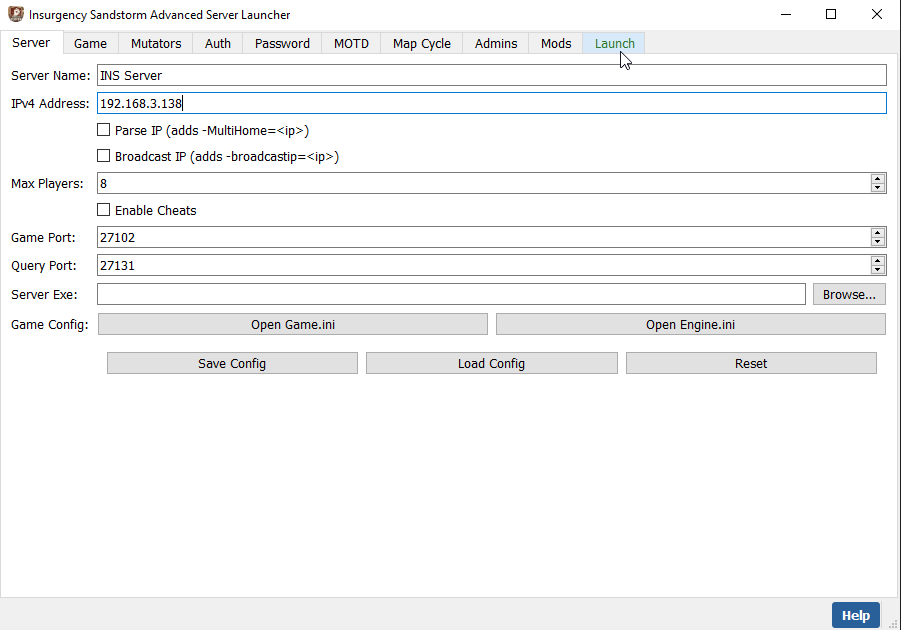

# Insurgency Sandstorm Advanced Server Launcher (GUI)

A PyQt5 desktop app that replaces the batch file launcher with a full GUI for configuring and launching your Insurgency Sandstorm dedicated server.



## Features

- Gamemode, team, map, and mutator selection (all gamemodes + ISMC mutators)
- Server settings: name, address, max players, cheat toggle
- Password protection
- Day/Night toggle
- IP parsing (`-MultiHome`) and broadcast IP
- Auth tokens for server authentication and game stats
- MOTD editor
- Map cycle generator
- Server admins manager (SteamID64)
- Mods list (`Mods.txt`) manager
- Save/load configuration (`launcher_config.json`)
- Auto-launch on startup option
- Live command preview before launching

## Requirements

- Python 3.10+
- PyQt5

## Setup

```bash
# Clone the repo
git clone https://github.com/bobbyfranco/INS_Sandstorm.git
cd "INS_Sandstorm/3.0 (GUI)"

# Create and activate a virtual environment
python -m venv .venv
.venv\Scripts\activate

# Install dependencies
pip install -r requirements.txt
```

## Running

```bash
python launcher.py
```

On first launch, use the **Server** tab to browse to your `InsurgencyServer.exe` and configure your settings, then head to the **Launch** tab to start the server.

## Building the Executable

Requires PyInstaller (`pip install pyinstaller`):

```bat
build.bat
```

The output executable (`InsurgencyServerLauncher.exe`) will be in the `dist/` folder.

## Running Tests

```bash
python -m pytest tests/ -v
```

48 tests covering state, command building, and data validation.
